# deploy ml_course :rocket:


### Содержание :page_with_curl:
* [О курсе](#about)
* [Jupyter в ProductCode](#p1)
* [Версионирование процесса](#p2)
* [API для модели](#p3)
* [СI/CD](#p4)
* [Feature Store](#p5)
* [Docker](#p6)
* [AirFlow](#p7)
* [Мониторинг](#p8)

<br>

-----------------------

### О курсе :key:

>

<a name="about"></a>

Основная цель данного курса — сформировать у слушателей понимание того, как применяются модели машинного обучения и как их использовать для решения бизнес-задач.

Знание этих процессов поможет аналитикам и специалистам по машинному обучению максимально адаптировать свои решения к промышленной эксплуатации. По итогам курса вы сможете лучше ориентироваться в производственной среде и понимать жизненный цикл моделей машинного обучения.

В ходе прохождения курса вы научитесь выстраивать процесс разработки модели для продуктивного решения бизнес-задач, пройдете путь трансформации от jupyter notebook кода до контейнеризации модели и автоматизации необходимых для её работы процессов. В курсе также будет уделено внимание метрикам и способам мониторинга моделей.

В результате вы получите полное представление о процессе продуктивизации моделей, что позволит сократить время выхода на рынок ваших решений и поможет понять инженерный процесс разработки.

Курс разработан при поддержке [НИУ ВШЭ](https://cs.hse.ru/dpo)

[Ссылка на курс на сайте НИУ ВШЭ](https://cs.hse.ru/dpo/announcements/414116513.html?fbclid=IwAR3L6Rv_APhsUJaBqNJnbl1TNg9Q9uhTHGGJDCGZwYB8lub0uJ93GKhRoQI)


**Знания для прохождения курса**

- Язык программирования Python (базовые библиотеки для Python, которые используются для работы с данными: numpy, pandas, sklearn)

- Знание принципов построения моделей машинного обучения

- Командная строка Linux

<br>

### Видео - плайлист курса на YouTube

[YouTube](https://www.youtube.com/playlist?list=PLEwK9wdS5g0qBXa94W7W0RNmrE0Ruook4)

-----------------------

### Часть 1 (Jupyter в ProductCode) :beginner:

> Вступительная часть к процессу продуктивизации моделей машинного обучения.

<a name="p1"></a>

Отвечая на вопрос, какие умения разработчика важны для DS, можно вспомнить статью [software dev skills for ds](http://treycausey.com/software_dev_skills.html) от Trey Causey и сказать:

- уметь тестировать
- уметь версионировать
- уметь логгировать [-> отличный пример](https://webdevblog.ru/logging-v-python/)
- уметь писать модули


#### Архитектуры ML приложений

Курс базируется на архитекутуре ML - _**train by batch, predict on fly**_

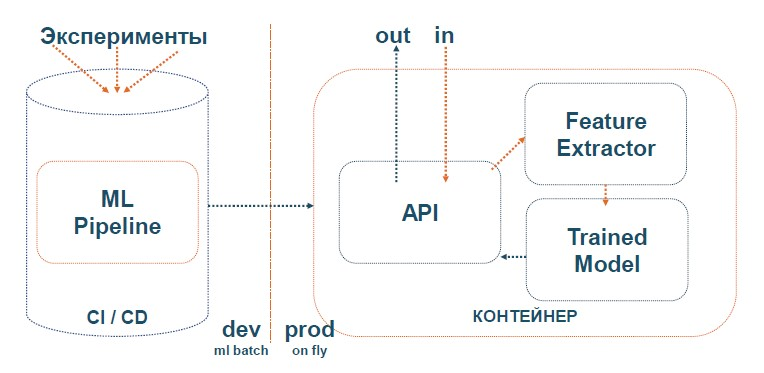

#### Виды ML pipeline (или модели вне jupyter notenook)

Будут рассмотрены основные виды ML Pipeline:

- Процедурные (на основе набора функций) с запуском через main.py

- Scikit-learn pipeline, построение и использование функций и классов в библиотеке Scikit-learn ([sklearn.pipeline.Pipeline](https://scikit-learn.org/stable/modules/generated/sklearn.pipeline.Pipeline.html))

- Custom (или объектно-ориентированный pipeline)

#### Тестирование

> Разбор основных видов тесто для ML проекта. В этой части рассматриваем 6 основных
вилов тестов, которые должны быть у модели и её процесса.
>
> Тесты помогут: **найти баги, подтвердить ваши ожидания от результата, ещё разв взглянуть на код (и может написать его проще), упрощают совместную работу, меньше удивляться от результата**.
>
> Перед знакомством с тестами, научимся делать дебаг и поиск ошибок в коде на примере игры о [pdb](https://github.com/NameArtem/deployml_course/tree/main/p1/src/pdb_game)
>
> Познакомимся с тестами через учебный проект по тестированию кода для теннисного турнира [ссылка](https://github.com/NameArtem/deployml_course/tree/main/p1/src/pytest_game)
>
> Позапускаем тесты
>
> _Run_
```python
pytest /path_to_test_script.py
```
>
> _Run + html отчет_
```python
pytest /path_to_test_script.py --html=report.html --self-contained-html
```
>
> _Run + code coverage report (результат по каждой функции)_
```python
pytest /path_to_test_script.py --cov=src --verbose
```
>
> _Run + multi CPU_
```python
pytest /path_to_test_script.py -n 5
```

-------------------

##### Объекты для которых нужны тесты

- Объекты извлекающие данные
- Объекты трансформирующие данные
- Модель (если она самописная)
- Обекты сохранения данных

-------------------

##### Идея тестов

* Тестировать всегда один объект из процесса (кода). Т.е. один юнит за один тест
* Не использовать зависимости в тестируемом коде из других процессов (юнитов)
* Минимизировать запросы к API / Базе данных
* Тестировать свойства, не значения **(для DS|DE)**
* Тестировать типы и размерности **(для DS|DE)**
* Генерируйте фичи для теста ([feature forge](https://feature-forge.readthedocs.io)), а не создавайте руками **(для DS|DE)**
* Используйте базовые методы из Numpy и Pandas для тестирования **(для DS|DE)**

```Python
# тесты должны быть осмысленные

def mean(some_list):
  # на примере:
  # тест на пустой список и деление на 0
  # TypeError тест
  # OverFlow тест
  return sum(some_list) / len(some_list)

# dev тест
import pytest
def test_dev_mean():
  assert(sum(mean([1,2,3])) / len(3) == 2)

# Но для DS
from hypothesis import given
import hypothesis.strategies as st

@given(st.lists(st.integers()))
def test_ds_mean(some_list):
  assert mean(some_list) == sum(some_list) / len(some_list)
```

```python
# тесты с проверкой типов / размерности
@is_shape(5, 10)
@is_monotonic(strict = True)
@non_missing()
def my_funct(df, columns):
  pass

```


-------------------
*К основным видам тестов относятся:*

1
Smoke test - тесты для опредления метода
```python
import pytest
from sklearn.linear_model import LinearRegression
def test_smoke():
    try:
        assert LinearRegression() is not None
    except NameError:
        pytest.fail("Model does not exist")
```

2
Проверка коннекторов к БД (если нужны для проекта)

**[Ссылка на Хабр, с большим объяснением](https://habr.com/ru/post/141209/)**

```python
import mock

def get_connect():
    engine = sqlalchemy.create_engine('connection_string')

    return df.read_sql("select * from *", con = engine)

@mock.patch('pytest_ex.text_connection.sqlalchemy.create_engine')
def test_connection(engine_mock, df):
    new_df = get_connect(engine_mock)

    pandas.testing.assert_frame_equal(new_df, df)


# или тестировать функции чтения
def df_from_csv(filename):
    return pd.read_csv(filename)

@mock.patch.object(pd, 'read_csv')
def test_df_from_csv(read_csv_mock, df):
    read_csv_mock.return_value = df
    actual = df_from_csv('file_name.csv')
    # ожидаемый результат
    expected = df
    # assertions
    pd.testing.assert_frame_equal(actual, expected)
```

3
Тесты на равенство / соответствие результатов после трансформации объекта

- Использовать pandas testing:

    -- pandas.testing.assert_frame_equal (сравнение DataFrame)

    -- pandas.testing.assert_series_equal  (сравнение колонок)

    -- pandas.testing.assert_index_equal  (сравнение строк по индексам)

    -- pandas.testing.assert_extension_array_equal  (сравнение любых массивов numpy)

-- Использование assert + numpy (методы сравнения объектов):

    -- np.allclose

    -- np.isclose

    -- np.any

    -- np.equal

-- Использование numpy testing методов:

    -- (Ссылка на документацию numpy asserts)[https://numpy.org/doc/stable/reference/routines.testing.html]

4
Тестирование существования файлов
```python
def df_from_csv(filename):
    """читаем все DataFrame в формате csv"""
    return pd.read_csv(filename)

def test_df_from_csv(filename):
    assert df_from_csv(filename) is not FileNotFoundError
```

5
Тестирование API
```python
import responses

@responses.activate
def test_api_404():
    responses.add(
        responses.GET,
        'https://your_path',
        json='ex_json',
        status=404,
    )


@responses.activate
def test_api_200():
    responses.add(
        responses.GET,
        'https://your_path',
        json={'ex_json'},
        status=200,
    )
```

6
Генерируйте данные для тестов на основе [hypothesis](https://hypothesis.readthedocs.io)

```python
import pandas as pd
from hypothesis import given
from hypothesis import strategies
from hypothesis.extra.pandas import column, data_frames
import builder

@given(
    # создавайте Pandas DataFrame для тестов
    data_frames(
    columns=[
        column(
            name='prog_start',
            elements=strategies.datetimes(
                min_value=pd.Timestamp(2020, 1, 1),
                max_value=pd.Timestamp(2020, 1, 10)
            )
        , unique=True),
        column(
            name='code',
            elements=strategies.just(float('nan'))
        )
    ])
)
def test_fix_new_boxes_nan_replaced(raw_prog):
    prog = builder.fix_new_boxes(raw_prog)
    assert (prog.mat_code == builder.NO_MAT_CODE).all()
    assert prog.shape == raw_prog.shape
```

#### Задание для самостоятельной работы

* Воспользуйтесь [шаблонами](https://github.com/NameArtem/deployml_course/tree/main/p1_homework) для sklearn.pipeline и процедурного pipeline, переделайте свою модель из эксперементального jupyter notebook в 3 вида pipeline

**Задание**

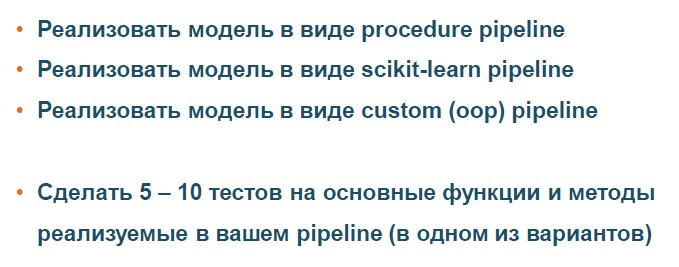


<br>

------------

### Версионирование процесса

> Разбор основных способов версионирования в GIT с проекцией на деятельность DS/DE.

<a name="p2"></a>

#### GIT

Предложена мультиветвенная система версиониования для монолитного проекта. **! Определитесь с неймингом процессов!**

О Git flow для DE/DS и основными шаблонами можно ознакомиться [в другом репозитории](https://github.com/NameArtem/gitFlowDE)

По ссылке вы найдете:

* шаблон для проекта

* шаблон для adhoc

* шаблон для Spark проекта

* набор готового кода для git

Ещё немного информации о git - [больше волшебства](https://dangitgit.com/ru)

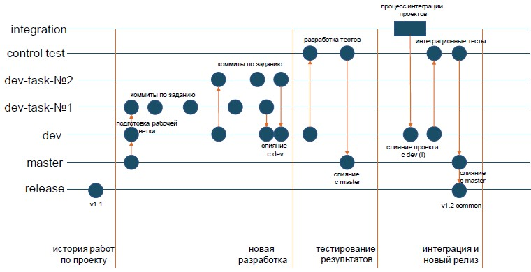

#### DVC

Рассмотрим инструмент [dvc](https://dvc.org/), отличный для экспериментов и фиксации процессов

```bash

dvc init

# отключаем аналитику наших процессов (чтобы не собиралась статистика)
dvc config core.analytics false

# устанавливаем наше хранилище для файлов
dvc remote add -d localremote /data/dvc-storage
```

----------------------------

Создаем params.yaml по шаблону:
```
# file params.yaml
название модели (эксперимента):
    параметры для эксперимента
```

----------------------------

Создаем шаги наших экспериментов (для трекинга):
```bash
dvc run -n STAGE_NAME \
-d все файлы от которых зависит процесс
-O все файлы, которые будут являться результатами процесса ( но не будут версионироваться)
-o все файлы, которые будут являться результатами процесса (будут версионироваться)
-M файл с метрикой
```

----------------------------

Основные команды для процессинга

```bash
# воспроизведение процесса (повторение от шага 1 до финального)
dvc repro

# сравнение параметров / метркиа
dvc params diff
dvc metrics diff

# визуализация процесса
dvc dag
```

---------------------------

<br>

#### KEDRO

Отличный проект [kedro](https://kedro.readthedocs.io/en/stable/), на основе которого будут выстроеные процессы на данном курсе

Проект является набором правил для разработки в МЛ. Но во время работы следует учитывать:
 * Не удалять (только дополнять) файл `.gitignore`
 * Работать в рамках [конвенции DE разработки](https://kedro.readthedocs.io/en/stable/12_faq/01_faq.html?highlight=convention#what-is-data-engineering-convention)
 * Переменные и конфиги эфемерные
 * Конфиги в `conf/local/`

```
# создать структуру проекта
kedro new

# в src/projectname/
# нужно создать pipeline (для каждого типа процессов - свой пайплайн)

# запуск jupyter notebook в kedro
kedro jupyter notebook
```

--------------------------

В проекте должны быть следующие pipelines:

- data engineering(etl + обработка данных)

- data science(обучение модели)

- predict_pipeline(предикт по модли и проверка качестве)

- predictapi_pipeline(предикт для работы через API)

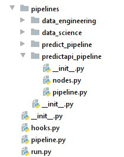

```python
# добавляем созданные pipeline
# в hook для запуска
de_pipe = de.create_pipeline()
ds_pipe = ds.create_pipeline()
pr_pipe = pr.create_pipeline()
pra_pipe = pra.create_pipeline()

return {
    "de": de_pipe,
    "ds": ds_pipe,
    "predict": pr_pipe,
    "predict_api": pra_pipe,
    "__default__": de_pipe + ds_pipe + pr_pipe,
}
```

Это позволяем запускать код по имени pipeline

```
# в bash
kedro run --pipeline='predict_api'

# в функции python
context.run(pipeline_name='predict_api')
```

-----------------------------

Pipeline модели в Kedro (у данного проекта)

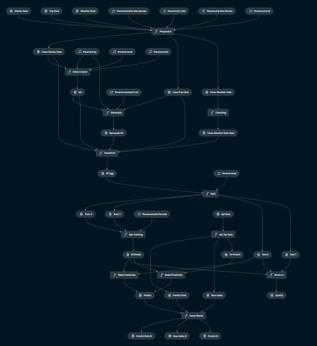


#### Задание для самостоятельной работы

**Задание**

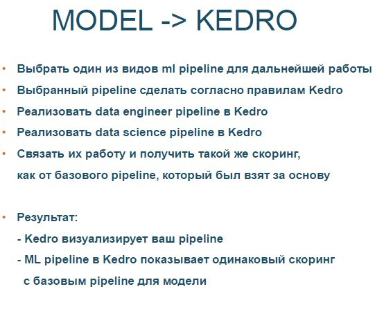

<br>

------------


### API для модели

> Зачем DS/DE знать про API?

Для выполнения данной работы вам может понадобиться: сервер API, получатель API.
Вы сможет найти их простые реализации [здесь](https://github.com/NameArtem/deployml_course/tree/main/p3_api_serv)


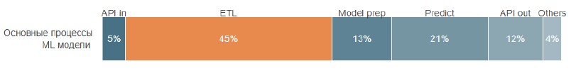

<a name="p3"></a>

В данной работе мы сделаем выбор 1 из 3 основных реализаций API.

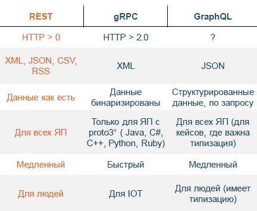


Мы будем использовать паттерны, которые поставляются с Kedro.

```python
# подключаем контекст Kedro
from kedro.context import load_context
from kedro.extras.datasets.api import APIDataSet
import json

# загружаем проект
context = load_context("../")
catalog = context.catalog

# используя APIDataSet из Kedro
# и устанавливаем конфиг
st = APIDataSet(
        url = "http://127.0.0.1:9876/data",
        headers = {"content-type": "application/json"}
).load()

# записываем в DF для работы из json
df = pd.DataFrame.from_dict(st.json()['data'], orient='index').T

# формируем результат для отправки назад по API
answer = {
        "predict_date": st.headers['date']
        "row_index": st.json()['index']
        "predict": model.predict(df)
}
```

<br>

------------

#### Задание для самостоятельной работы

**Задание**

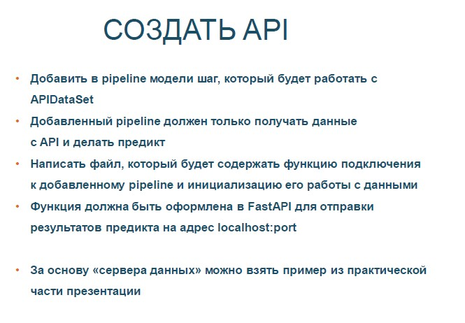

<br>

------------


### CI/CD

> Разработка через тестирование для DS - реальность!

<a name="p4"></a>

Рассмотрим, какие тесты нужно делать для DS/DE пайплайнов и как их делать. И немного погрузимся в методологию TDD.

Опять переделаем пайплайн, так как рассмотрев [пример](notebooks/testProblem.ipynb) проблемы и поймем, что делали работу не по TDD методологии.

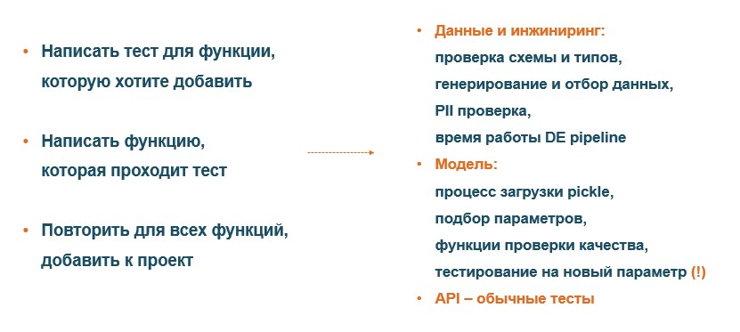

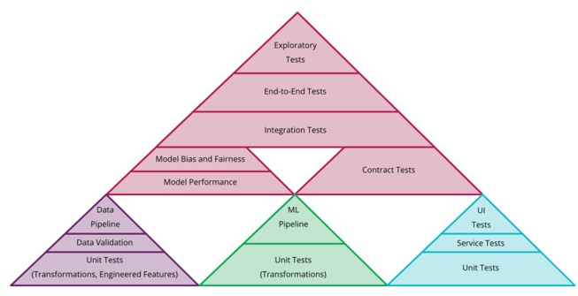

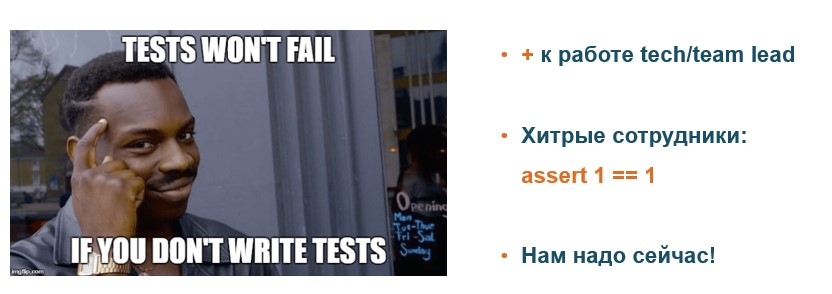

</br>

#### Тесты с hypothesis

Рассмотрим пример разработки теста для функции:
```python
# функция для тестирования
def index_creator(df, mind, maxd, freq):
    by = 'Station'
    newCol = 'Datetime'
    return pd.MultiIndex \
             .from_product([df[by].sort_values().unique(),
                            pd.Index(pd.date_range(mind,
                                                   maxd,
                                                   freq=freq))],
                            names=[by, newCol])
```

Скрипт по разработке теста

```python
import pandas as pd
import numpy as np

from hypothesis import given
from hypothesis import strategies as st
from hypothesis.extra.pandas import data_frames, column
from scipy.special import expit

import matplotlib.pyplot as plt
import seaborn as sns


# создадим DF для работы (генерация случайного ДатаФРейма)
# генерация данных для функции
# получаем элементы из given
# создаем случайный
import string

df = data_frames(
        [
            column('Station', dtype=str,
                   elements=st.text(alphabet=f"{string.ascii_letters}{string.ascii_lowercase}", min_size=5)),
            column('DateOfPeriod',
                   elements=st.datetimes(min_value=datetime.datetime.strptime('2019-01-01 00:00:00', '%Y-%m-%d %H:%M:%S'),
                                         max_value=datetime.datetime.strptime('2021-01-01 00:00:00', '%Y-%m-%d %H:%M:%S'))),
        ]
    ).example()

# создаем переменные для даты и время
mn = st.datetimes(min_value=datetime.datetime.strptime('2019-01-01 00:00:00', '%Y-%m-%d %H:%M:%S'),
                 max_value=datetime.datetime.strptime('2021-01-01 00:00:00', '%Y-%m-%d %H:%M:%S')).example()
mx = st.datetimes(min_value=datetime.datetime.strptime('2019-01-01 00:00:00', '%Y-%m-%d %H:%M:%S'),
                 max_value=datetime.datetime.strptime('2021-01-01 00:00:00', '%Y-%m-%d %H:%M:%S')).example()


# что нам нужно получить для функции
# переменные
mind = mn
maxd = mx
freq = 'H'
# константы
by = 'Station'
newCol = 'Datetime'

pd.MultiIndex \
  .from_product([df[by].sort_values().unique(),
                 pd.Index(pd.date_range(mind,
                                        maxd,
                                        freq=freq))],
                 names=[by,
                        newCol])

# тесты
# соответсвие класса (smoke)
index_creator(df, mn, mx, 'D').__class__ == pd.core.indexes.multi.MultiIndex
# правильный способы проверки класса
isinstance(index_creator(df, mn, mx, 'D'), pd.MultiIndex)
# что будет в нужной структуре и не пустой индекс с уровнями, именами и определителями
try:
    pd.testing.assert_index_equal(index_creator(df, mn, mx, 'D'),
                                      pd.core.indexes.multi.MultiIndex(levels = [['', '0'], []],
                                                                       names = ['Station', 'Datetime'],
                                                                       codes=[[], []]))
except AssertionError:
    True


with pytest.raises(AssertionError):
    pd.testing.assert_index_equal(index_creator(df, mn, mx, 'D'),
                                  pd.core.indexes.multi.MultiIndex(levels = [['', '0'], []],
                                                                   names = ['Station', 'Datetime'],
                                                                   codes=[[], []]))
```


</br>

</br>

#### GitHub Actions

Actions создаются в формате `YAML` и должны находится в папке `.github/workflows`.
В Actions учавствуют следующие элементы:
* **event** триггер к действияю
* **machine** место, где запускается джоб
* **The jobs** процесс выполняющий задачи
* **The steps** задачи для джоба

```yaml
#.github/workflows/first_workflow.yml
name: First Workflow                                               
on: push                                                  
jobs:                         
  first-job:                           
    name: Hello                         
    runs-on: ubuntu-latest                           
    steps:                           
    - name: Print a greeting                             
      run: echo Hellow!
```

**Использование Action**

Action - это одна задача, которая:

* Вызывается в том же репозитории, где и хранится код

* Который хранится отдельным репозиторием

* Который выполняется в контейнере

```yaml
# .github/workflows/first_workflow.yml
name: First Workflow
on: push                                                  
jobs:                         
  first-job:                           
    name: Hellow                  
    runs-on: ubuntu-latest                           
    steps:                           
      - name: Print a greeting                             
        run: echo Hello!   

      - name: Show ASCII greeting                             
        uses: mscoutermarsh/ascii-art-action@master   
        with:                               
          text: 'HELLO!'
```

**Интеграция Python в Action**

Для интеграции Python в GitHub Actions необходимо в контейнер установить Python, можно использовать специальный Action: `setup-python` и проверить доступность файлов через Action `checkout`.

```yaml
# .github/workflows/first_workflow.yml
name: First Workflow
on: push                                                  
jobs:                         
  get-posts-job:                            
    name: Run                      
    runs-on: ubuntu-latest     
    steps:                             
      - name: Check-out the repo under $GITHUB_WORKSPACE                               
        uses: actions/checkout@v2         

      - name: Set up Python 3.8                               
        uses: actions/setup-python@v2                               
        with:                                 
          python-version: '3.8'          

      - name: Install Scrapy                               
        run: pip install scrapy         

      - name: Run Python command                              
        run: scrapy runspider posts_spider.py -o posts.json
```

**Получить данные из Git с помощью Actions**

Ваши процессы могут возвращать результат, вы можете получать результат и скачивать его из Git с помощью Actions `upload-artifact` и `download-artifact`.

```yaml
# .github/workflows/first_workflow.yml
name: First Workflow
on: push                                                  
jobs:                         
  get-posts-job:                            
    name: Run          
    runs-on: ubuntu-latest     
    steps:                             
      - name: Check-out the repo under $GITHUB_WORKSPACE                               
        uses: actions/checkout@v2         

      - name: Set up Python 3.8                               
        uses: actions/setup-python@v2                               
        with:                                 
          python-version: '3.8'          

      - name: Install Scrapy                               
        run: pip install scrapy         

      - name: Run Python                              
        run: scrapy runspider posts_spider.py -o posts.json

      - name: Upload artifact                      
        uses: actions/upload-artifact@v2                        
        with:                                 
          name: posts                                 
          path: posts.json
```

**Создать Action самостоятельно**

Action создается, как Docker контейнер ([про Docker](#p6)), файл с описание парсится при с помощью TypeScript.

```yaml
name: 'Любое имя для GitHub Action'
description: 'Описание его действия, что ему нужно на вход и какой будет результат'
inputs:
  user:  
    description: 'Описание входящих данных'
    required: true
    default: 'Что будет по умолчанию'
runs:
  using: "composite"
  steps:
    - run: команда, которая запускает процесс
      shell: bash/ЯП
```

#### Примеры GitHub actions

```yaml
# Пример WorkFlow, который
# запускает установку Python и зависимостей, запускает tests


name: Tests
# для каких действий запускать данный WorkFlow
on:
  push:
    branches: [ main ]
  pull_request:
    branches: [ main ]
jobs:
  build:
    runs-on: ubuntu-latest
    steps:
    - uses: actions/checkout@v2
    - name: Set up Python 3.8
      uses: actions/setup-python@v2
      with:
        python-version: 3.8
    - name: Install dependencies
      run: |
        python -m pip install --upgrade pip
        pip install flake8 pytest
        if [ -f requirements.txt ]; then pip install -r requirements.txt; fi
    - name: Lint with flake8
      run: |
        # stop the build if there are Python syntax errors or undefined names
        flake8 . --count --select=E9,F63,F7,F82 --show-source --statistics
        # exit-zero treats all errors as warnings. The GitHub editor is 127 chars wide
        flake8 . --count --exit-zero --max-complexity=10 --max-line-length=127 --statistics
    - name: Test with pytest
      run: |
        pytest
```

```yaml
# Action для CodeReview

name: Code review
on:
  push:
  pull_request:
jobs:
  pycodestyle:
    name: pycodestyle
    runs-on: ubuntu-latest
    steps:
    - uses: actions/checkout@master
    - name: wemake-python-styleguide
      uses: wemake-services/wemake-python-styleguide@0.14.1
      with:
        reporter: 'github-pr-review'   # для репорта ошибок в PR комментарии
      env:
         GITHUB_TOKEN: ${{ secrets.GITHUB_TOKEN }}
```

</br>


#### Задание для самостоятельной работы


**Задание**

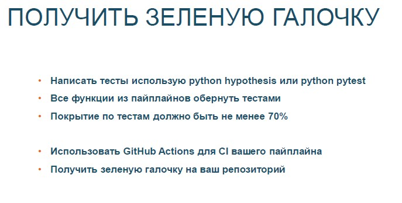

------------


### Feature Store

> Сделаем шаг в сторону от модели и рассмотрим специальный тип хранилища, но для DS.

<a name="p5"></a>

#### Great Expectations

[Great Expectations](https://docs.greatexpectations.io/en/latest/) - это специальный инструмент для тестирования данных и фиксации их профилирования.

GE встраиватся в pipeline для тестирования входных данных.


Создан для DE/DS:

* Помощь в работе с данными и мониторинге

* Помощь в нормализации данных

* Улучшение взаимодействия аналитиков и инженеров

* Построение автоматической верификации новых данных

* Ускорение поиска ошибок в данных

* Улучшение передачи данных между командами

* Построение документации для данных


Пример использования:

```python
import datetime
import numpy as np
import pandas as pd
import great_expectations as ge
import great_expectations.jupyter_ux
from great_expectations.datasource.types import BatchKwargs

# создаем контекст
context_ge = ge.data_context.DataContext("..")

# создаем набор параметров
expectation_suite_name = "bike.table.trips.st" # имя набора
context_ge.create_expectation_suite(expectation_suite_name)

# определяем тип ресурсов (вот, что мы забыли - 2)
context_ge.add_datasource('pandas_datasource', class_name='PandasDatasource')
batch_kwargs = {'dataset': catalog.load('trip_data'), 'datasource': "pandas_datasource"}

# создаем батч с данными и передаем в него имя набора, которое будет наполнять тестами
batch = context_ge.get_batch(batch_kwargs, expectation_suite_name)
```

Для дальнейшей работы с GE используйте [правила](https://docs.greatexpectations.io/en/latest/reference/glossary_of_expectations.html)

```python
# используем разные expectations для создания правил по данными
batch.expect_column_values_to_be_unique('Trip_ID')

# зафиксируем правила по данным и сохраним их
batch.save_expectation_suite(discard_failed_expectations=False)

# зафиксируем время создание данного обзора
run_id = {
  "run_name": "bike.train.part_trip",
  "run_time": datetime.datetime.utcnow()
}
results = context_ge.run_validation_operator("action_list_operator", assets_to_validate=[batch], run_id=run_id)


# сделаем валиадацию данных
df.tail(100).validate(expectation_suite=batch.get_expectation_suite())  #result

# создаем html документацию
context_ge.build_data_docs()
context_ge.open_data_docs()
```

GE сделаем ваши данные:
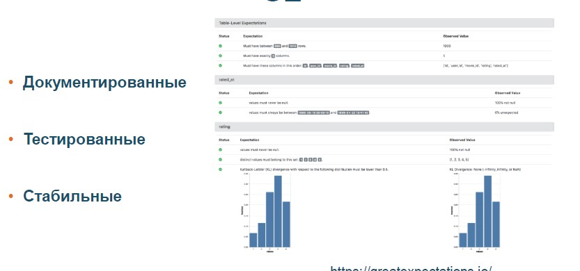


Использование GE в Kedro

```python
def data_qual(df: pd.DataFrame):
    """
    Функция для тестирования данных в pipeline
	Одна функция - одная проверка

    :param df:
    :return: df
    """
    df = ge.from_pandas(df)

    # создаем проверку
    result = df.expect_column_values_to_be_in_set('Subscriber_Type',
                                                  list(df['Subscriber_Type'].unique()),)
                                                  #mostly=.99)

    if not result['success']:
        err = result["exception_info"]
        raise Exception(f"You get unexpected data in Subscriber_Type column\n{err}")

    return df
```

Добавляем в пайплан Kedro

```python

# Создаем отдельный DataQuality pipeline
checked_pipe = Pipeline([node(q.data_qual,
                             "trip_data",
                             "trip_data_cheked")
                        ])

    return {
		# ставим на позицию перед основным pipeline
        "de": checked_pipe + de_pipe,

```

</br>

#### Feature Store

Существует проблема передачи фичей для моделей между командами и DS

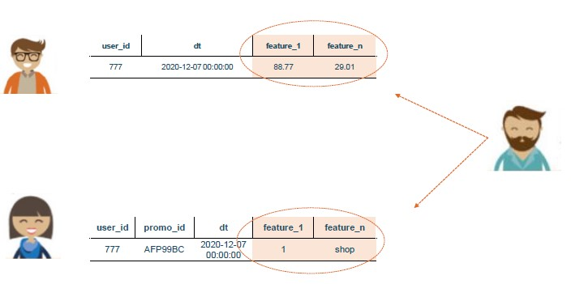

Feature Store - инструмент, который получает таблицу с данными и отправляет на хранение. Имеет 2 вида объектов: ключи и данные (ввиде колонок)

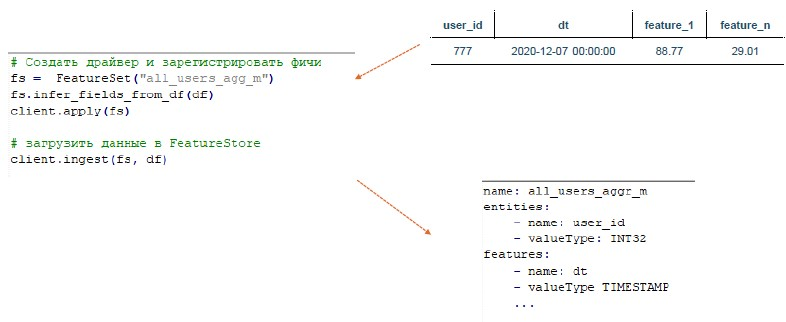

Разница между DWH и Feature Store

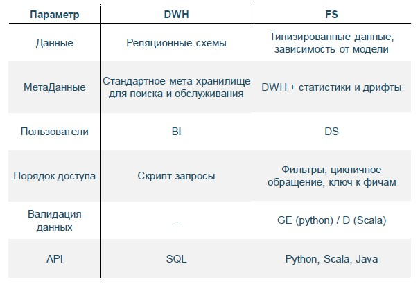


</br>

#### Задание для самостоятельной работы


**Задание**

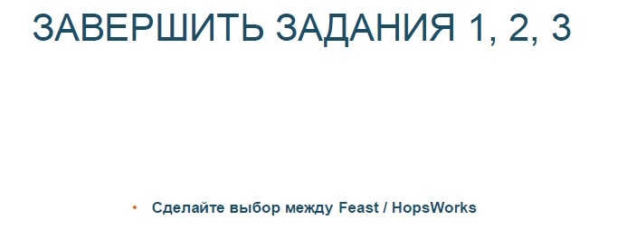


------------


### Docker 

> В этой части я попытался ответить на вопрос: "Нужен ли Docker для DS/DE?". Это отличное решение для изоляции разработок и мгновенной передачи в прод.. 
> Выбранные решения на базе Kedro + GitHub + GitHub Action позволяют пронести процесс от разработки до готового контейнера

<a name="p6"></a>

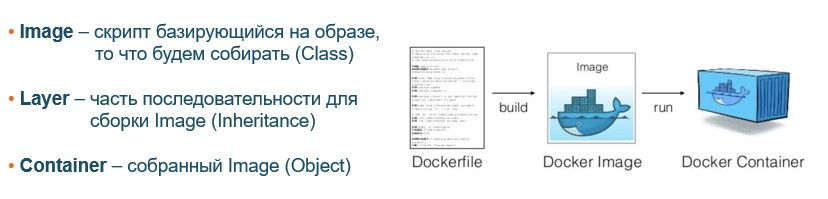

Формируем Docker контейнер на базе файла Dockerfile:

- FROM - на какой базе 
- ENV - установка окружения
- WORKDIR – создание директории для работы
- COPY / ADD– копируем с «машины» в Docker контейнер
- RUN - первые команды в Shell (выполнено / установлено)
- EXPOSE - указание портов
- CMD / ENTRYPOIN - что запустить в докере [команда, параметры,,,] 

Пример:

```yaml
FROM python:3.7

ENV PYTHONDONTWRITEBYTECODE 1
ENV PYTHONUNBUFFERED 1

RUN apt-get update \
    && apt-get -y install gcc make \
    && rm -rf /var/lib/apt/lists/*

RUN pip install --no-cache-dir --upgrade pip

WORKDIR /model

# copy requirements.txt
COPY deployml_course/requirements.txt /model/requirements.txt

# install project requirements
RUN pip install --no-cache-dir -r requirements.txt

# copy project
COPY deployml_course/ /model

EXPOSE 6789

ENTRYPOINT [ "python" ]
CMD [ "runner.py"] 
```

Используейте `.dockerignore` (загружайте необходимый минимум в контейнер) + [GitHub Action](https://github.com/marketplace/actions/build-and-push-docker-images) для деплоя ваших разработок.

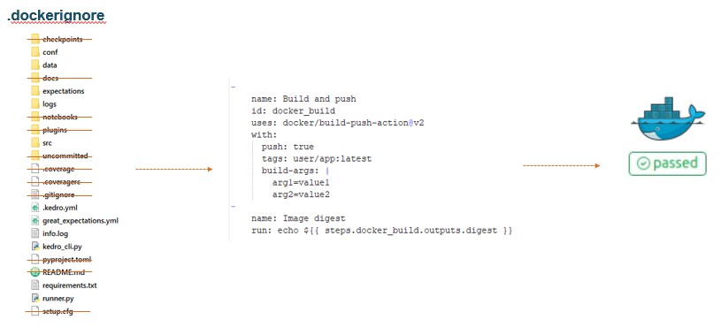

</br>

#### Задание для самостоятельной работы


**Задание**

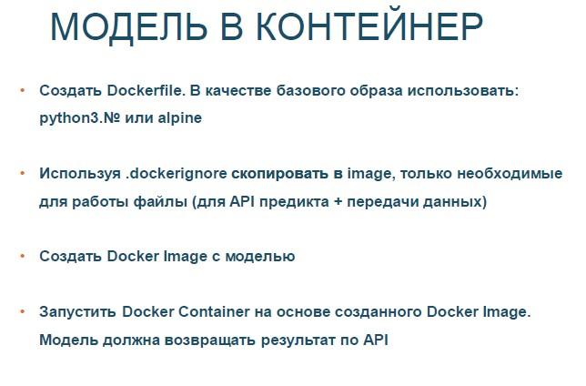


<br>

------------


### AirFlow

> Рассмотрим ETL для DE части нашей моделе. Мы не сразу используем AirFlow, а сначала посмотрим простой инструмент для ETL - Bonobo

<a name="p7"></a>

Файл [docker-compose](p7_airflow_container/docker-compose.yml) для деплоя AirFlow + PostgreSQL в виде Docker контейнеров.

В это части, мы попытаемся решить проблемы ETL процесса (и найдем инструмент, который это решит):

* Масштабируемость

* Работа с «неудачными» выполнениям

* Мониторинг

* Зависимости

* Сохранение историчности


### Простой ETL (+ bonobo)

Пример Bonobo ETL для работы с HTTP API

```python
import bonobo
import requests
from bonobo.config import use_context_processor
from bonobo.config import use

# используем http из bonobo
@use('http')
def extract(http):
    """
        Получаем данные с сервиса
    """
    yield from http.get('http://IP:9876/data').json().get('data')


def get_services():
    """
       Указываем тип сервиса
    """
    http = requests.Session()
    return {
        'http': http
    }    
    
    
def with_opened_file(self, context):
    """
        Файл для записи результатов
    """
    with open('output.txt', 'w+',  encoding='utf-8') as f:
        yield f

# на основе контекста, который работыет с файлом
# мы создаем контролиремый процесс записи
@use_context_processor(with_opened_file)
def write_repr_to_file(f, *row):
    """
       Записываем все полученные строки в файл
    """
    f.write(repr(row) + "\n")


def get_graph(**options):
    """
       создаем граф выполнения
    """
    
    graph = bonobo.Graph()
    
    graph.add_chain(
        extract,
        write_repr_to_file,
    )
    return graph


# выполним и посмотрим на результат
bonobo.run(get_graph(), services=get_services())
```

#### Bonobo + Kedro 

```python
from kedro.context import load_context
from kedro.extras.datasets.api import APIDataSet

def kedro_de_pipeline():
    """
        подключаем нужный pipeline
    """
    context = load_context("../")
    context.run(pipeline_name='de')

def get_graph(**options):
    """
       создаем граф выполнения
    """
    
    graph = bonobo.Graph()
    
    graph.add_chain(
        kedro_de_pipeline        
    )
    return graph

bonobo.run(get_graph())
```

### ETL на AirFlow

AirFlow является отличным решением для сложных задач, этот инструмент решает ETL проблемы и имеет следующие приемущества:

* наличие наглядного веб-GUI для визуализации конвейеров обработки данных

* есть scheduler (у остальных, только cron)

* пакетный характер работы с данными (batch processing)

* популярность в области Big Data(много контекстов для BigData решений)

* есть историчность данных

* есть общее хранилище для переменных и параметров

* есть сенсоры, которые могут управлять DAG

AirFlow имеет набор приемуществ, которые позволяеют ему реализовывать:

- **Sensors (на [git](https://github.com/apache/airflow/tree/master/airflow/sensors)):**
    * HdsfSensor - ожидает появления нового файла в таблице Hadoop
    * NamedHivePartitionSensor - проверяет доступность партиций в Hive таблице
    * DateTime / TimeDelta- зависимость от времени
    * Filesystem / FileSensor - если появился новый файл в заданной директории
    * Python - если какой-нибудь(указаный в условиях) python файл вернул True

**!NB** Вы всегда можете добавить свой собственный сенсор:
```python
from airflow.sensors.base import BaseSensorOperator

class MySensor(BaseSensorOperator):
    
    @apply_defaults
    def __init__(self, *, параметры для данного сенсор, **kwargs):
        super().__init__(**kwargs)
        ...

    def poke(self, context):
        ...
    
```

---------------------------------------------------------------------------------------

 
- **Operators (на [git](https://github.com/apache/airflow/tree/master/airflow/operators)):**
    * BashOperator
    * PythonOperator
    * HiveOperator
    * HttpOperator
    * Postgres/MySqlOperator
    * SubDag
    
**!NB** Вы всегда можете добавить свой собственный оператор:
```python
from airflow.models import BaseOperator

class MyBestOperator(BaseOperator):
    
    @apply_defaults
    def __init__(self, *, параметры для данного оператора, **kwargs):
        super().__init__(**kwargs)
        ...
        
    def execute(self, context):
        ...
```

---------------------------------------------------------------------------------------
    
- **Transfers:**
    * MySql/PostgresToHiveTransfes


---------------------------------------------------------------------------------------

Рассмотрим пример:

```python
# Шаг 1
from datetime import datetime, timedelta
from airflow import DAG
from airflow.models import Variable
from airflow.operators.dummy_operator import DummyOperator
from airflow.operators.python_operator import PythonOperator

# + создаем функции
def my_func():
    return "Dream func - Всё необходимое в одной функции"


# установка Apache Airflow Variables 
# /admin/variable/ -> Create new | или загрузить json с переменными
AUTHOR = Variable.get("desc_dict", deserialize_json=True)['dml']['author']


# Шаг 2 (аргументы)
default_args = {
    "owner": "airflow",
    "depends_on_past": False,              # зависимость от прошлого результата
    "start_date": datetime(2020, 12, 21),  # первая дата выполнения -> airflow.utils.dates.days_ago(#)
    # "end_date":                          # последняя дата (выполнять до)
    "retries": 1,                          # повторных запусков
    "retry_delay": timedelta(minutes=2),   # повторный запуск через кол-во минут
    # email | email_on_failure | email_on_retry 
    # 'queue': 'bash_queue',
    # 'pool': 'backfill',
    # 'priority_weight': 10,
    # 'wait_for_downstream': False,
    # 'dag': dag,
    # 'sla': timedelta(hours=2),
    # 'execution_timeout': timedelta(seconds=300),
    # 'on_failure_callback': some_function,
    # 'on_success_callback': some_other_function,
    # 'on_retry_callback': another_function,
    # 'sla_miss_callback': yet_another_function,
    # 'trigger_rule': 'all_success'
}


# Шаг 3 (описание)
dag = DAG(
    "steps_in_DAG",                          # имя процесса
    description="Все шаги для создания DAG", # описание
    schedule_interval="0 0 * * *",           # аналогично, как в cron
    default_args=default_args,
    catchup=False                            # catchup - концепция
    
    # catchup - DAG разбивается на шаги, каждый шаг - это отдельный запуск. 
    # При параметре True, DAG будет выполнятся по отдельности, без очередности (каждый шаг в разный момент)
)


# Шаг 4
task1 = DummyOperator(task_id="dummy_task",
                      retries=3,
                      dag=dag)


# Документирование каждого задани
task1.doc_md = """
# Task 1

Здес описано задание 1 для Apache Airflow
"""

dag.doc_md = __doc_


task2 = PythonOperator(task_id="my_func_task",
                       python_callable=my_func,
                       dag=dag)


# можно добавить визуальный шаблон
templated_command = """
echo "{{ var.value.AUTHOR }}"
echo "{{ params.best_param }}"
"""

task3 = BashOperator(
    task_id='templated',
    depends_on_past=False,
    bash_command=templated_command,
    params={'best_param': 'О, да! Ты подобрал лучшие параметры'},
    dag=dag,
)


# Шаг 5 (установка последовательности)
# установка последовательности
task1 >> task2 >> task3

# равнозначно
# task2.set_upstream(task1)

# task1.set_downstream([task2, task3])
# task1 >> [task2, task3]

# в обратном порядке
# [task2, task3] << task1
```

#### AirFlow + Kedro

```python
import sys
from datetime import datetime, timedelta

from airflow import DAG
from kedro_airflow.runner import AirflowRunner
from kedro.framework.context import load_context


# Установка аргументов
default_args = {
    "owner": "kedro",
    "start_date": datetime(2020, 12, 21),
    "depends_on_past": False,
    "wait_for_downstream": True,
    "retries": 1,
    "retry_delay": timedelta(minutes=10),
}


# Функция создания контекста и определения pipeline для запуска
def process_context(data_catalog, **airflow_context):
    
    for key in ["dag", "conf", "macros", "task", "task_instance", "ti", "var"]:
        del airflow_context[key]
        
    data_catalog.add_feed_dict({"airflow_context": airflow_context}, replace=True)

    parameters = data_catalog.load("parameters")
    parameters["airflow_de_pipeline"] = airflow_context["de"]
    data_catalog.save("parameters", parameters)

    return data_catalog


# Создаем DAG для Kedro
dag = DAG(
    "bike",
    description="DE pipeline для bike модели",
    default_args=default_args,
    schedule_interval=None,
    catchup=False
)


# загружаем контекст kedro (как обычно, как в Bonobo)
_context = load_context("")
data_catalog = _context.catalog
pipeline = _context.pipeline

# создаем airflow процесс
runner = AirflowRunner(
                       dag=dag,
                       process_context=process_context,
                       operator_arguments=dict(),
                       )

# инит процесса == task1 >> task2 >> ...
runner.run(pipeline, data_catalog)	
```

**kedro может больше, kedro сам может создать себе готовый код для airflow**:

```bash
# наберите в командной строке, там где у вас расположен проект 
kedro airflow create
```


</br>

#### Задание для самостоятельной работы


**Задание**

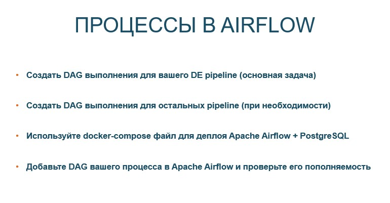

<br>

------------


### Мониторинг

> Метрик много, но какие выбрать для мониторинга за моделью, а какие принять для определения качества моделей?


<a name="p8"></a>

Не достаточно смотреть на кривые и площади под ними.  Но можно с этого начать

</br>

**Для классификации**

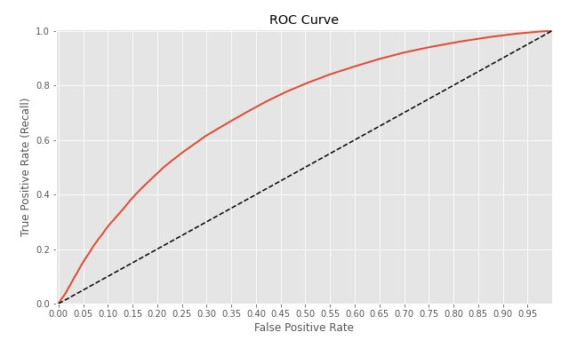

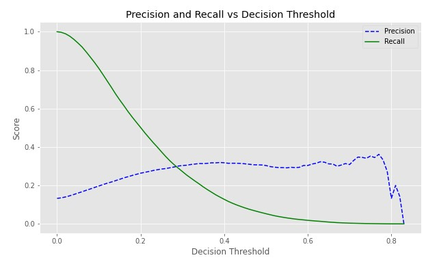

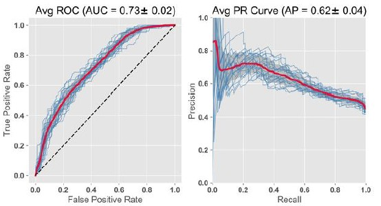

</br>

**Для регрессии**


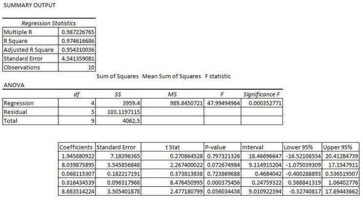

</br>

**Не забудьте проверить входные параметры для модели**

Самый эффективный способ - это следить за стабильностью данных, т.е. использовать [PSI - population stability index](https://wiki.loginom.ru/articles/stability-index.html)


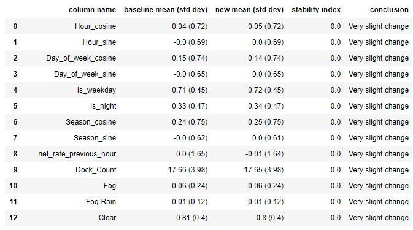

Результат при изменении данных

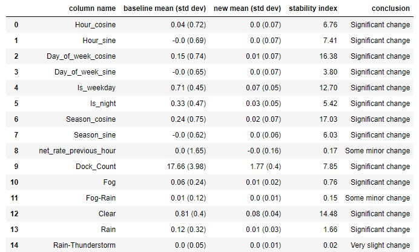

<br>

#### Мониторинг в прод

Метрики для Model Quality не всегда подохят для мониторинга в работе.

Разберем пример на примере MCC

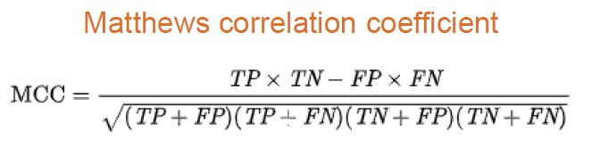

И сравним его результаты с  F1 для бинарной классификации

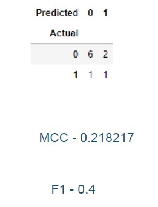

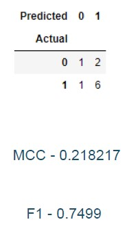

<br>

#### AB Test

Рассмотрим 2 варианта АБ тестирования:

- новую модель со старой моделью

- все модели со всеми

```python
import pandas as pd
%matplotlib inline

import math
import scipy.stats as stats

import numpy as np
import matplotlib.pyplot as plt

from statsmodels.stats.proportion import proportions_ztest
from statsmodels.stats.proportion import proportions_chisquare

import seaborn as sns
sns.set(color_codes=True)

from datetime import timedelta
import datetime
import time
import os
```


```python
# Цвета для виз
color_hex_list = ['#88CCEE', '#CC6677', '#DDCC77', '#117733', '#332288', '#E58606',  '#999933', '#882255', '#661100', 
 '#5D69B1', '#52BCA3', '#99C945', '#CC61B0', '#24796C', '#DAA51B', '#2F8AC4', '#764E9F', '#ED645A']
```

---

##### НАСТРОЙКИ ДО ТЕСТА

##### Размер группы

Если вы не хотите считать сами, воспользуйтесь готовы решением на сайте: [ссылка](https://www.evanmiller.org/ab-testing/sample-size.html)


```python
# установка базовых переменных
baseline_probability = 0.10
beta = 0.2
alpha = 0.05
effectSize = 0.01

# определяем one-side или two-side тест
one_sided = True 
```

##### Рассчитаем стартовые данные 


```python
alpha_Zscore = stats.norm.ppf(1-alpha*(1-0.5*(1-one_sided)))
beta_Zscore = stats.norm.ppf(1-beta)

print('Baseline Conversion (pr) = ', baseline_probability*100, '%')
print('Confidence Level = ', (1-alpha)*100, '%')
print('Alpha Z-score (za) = ', round(alpha_Zscore,2))
print('Power = ', (1-beta)*100, '%')
print('Beta Z-score (zb) = ', round(beta_Zscore,2))
print('Effect Size (E) = ', effectSize*100, '%')
```

    Baseline Conversion (pr) =  10.0 %
    Confidence Level =  95.0 %
    Alpha Z-score (za) =  1.64
    Power =  80.0 %
    Beta Z-score (zb) =  0.84
    Effect Size (E) =  1.0 %
    

##### Функция установки "траффика", который будет проходить через модель


```python
def sample_size(E, za, zb, pr):
    variance = pr*(1-pr)  # эту часть можно заменить на baseline по модели
    z = (za+zb)**2
    top = 2*variance*z
    bottom = E**2
    n = top/bottom
    return n

n = sample_size(effectSize, alpha_Zscore, beta_Zscore, baseline_probability)
print('Sample Size (per variation)=',round(n,0))
```

    Sample Size (per variation)= 11129.0
    

##### Определяем минимальный значимый эффект

- расчет на основе alpha / beta / размер группы
- для обнаружения минимального эффекта, мы должны заранее определить размер группы (максимальный)


```python
# функция оценки эффекта
def measurable_effect_size(n, za, zb, pr):
    variance = pr*(1-pr)  # эту часть можно заменить на baseline по модели
    z = (za+zb)**2
    top = 2*variance*z
    bottom = n
    E = math.sqrt(top/n)
    return E

# минимальный эффект
measurable_effect_size(n, alpha_Zscore, beta_Zscore, baseline_probability)
```

    0.01


##### Alpha Cutoff 

Сделаем обработку параметра Alpha на количество ожидаемых значений (для классификации), важно для ошибки первого рода. 

Мы считаем - Familywise Error Rate (Alpha Inflation)

```python
# количество сегментов для сравнения (кол-во значений в таргите)
segments = 2
```


```python
# вероятность ошибки в тести, определеяем для действия - alpha cutoff

1 - (1-alpha)**segments
```

    0.09750000000000003

```python
print("Допустимые коррекции:")
print("Тестирование гипотез на уровне α∗ = (α/segments) = ({a}/{seg}) = {aseg} (где {seg} - кол-во сегментов в группе).".format(a=alpha, seg=segments, aseg = alpha/segments))
print("Гарантированная ошибка 1 типа не будет привышать α = {}".format(round((1 - (1-alpha)**segments),3)))
print("However, this adjustment may be too conservative.")
```

    Допустимые коррекции:
    Тестирование гипотез на уровне α∗ = (α/segments) = (0.05/2) = 0.025 (где 2 - кол-во сегментов в группе).
    Гарантированная ошибка 1 типа не будет привышать α = 0.098
    However, this adjustment may be too conservative.
    
---

##### Данные

Для теста надо иметь в данных следующее:

- id пользователя 
- дата
- тип группы 
- параметры для сравнения


```python
file_name = 'Data/sd.csv'
date_sort = 'date_visit'

# загрузим
data = pd.read_csv(file_name,
                  converters= {date_sort: pd.to_datetime} )
df = data.copy()
df = df.sort_values(date_sort, ascending = True)
df = df[df['version'].isin(['A1', 'A2'])]

# Определение конверсий
traffic_label = 'clicked'
conversion_label = 'liked'

# Группировка
user_label = 'user_id'
date_label = 'date_visit'
segment_label = 'version'

segment_list = list(df[segment_label].unique())

df.head()
```

<div>
<style scoped>
    .dataframe tbody tr th:only-of-type {
        vertical-align: middle;
    }

    .dataframe tbody tr th {
        vertical-align: top;
    }

    .dataframe thead th {
        text-align: right;
    }
</style>
<table border="1" class="dataframe">
  <thead>
    <tr style="text-align: right;">
      <th></th>
      <th>user_id</th>
      <th>date_joined</th>
      <th>date_visit</th>
      <th>version</th>
      <th>type</th>
      <th>category</th>
      <th>visits</th>
      <th>clicked</th>
      <th>clicks</th>
      <th>liked</th>
      <th>likes</th>
    </tr>
  </thead>
  <tbody>
    <tr>
      <th>312</th>
      <td>31098584</td>
      <td>2018-04-27</td>
      <td>2018-04-23</td>
      <td>A1</td>
      <td>1</td>
      <td>NaN</td>
      <td>1</td>
      <td>1</td>
      <td>1</td>
      <td>0</td>
      <td>0</td>
    </tr>
    <tr>
      <th>310</th>
      <td>31098581</td>
      <td>2018-04-27</td>
      <td>2018-04-23</td>
      <td>A2</td>
      <td>0</td>
      <td>NaN</td>
      <td>1</td>
      <td>1</td>
      <td>2</td>
      <td>1</td>
      <td>5</td>
    </tr>
    <tr>
      <th>309</th>
      <td>31098580</td>
      <td>2018-04-27</td>
      <td>2018-04-23</td>
      <td>A1</td>
      <td>0</td>
      <td>NaN</td>
      <td>1</td>
      <td>1</td>
      <td>1</td>
      <td>0</td>
      <td>0</td>
    </tr>
    <tr>
      <th>307</th>
      <td>31098577</td>
      <td>2018-04-27</td>
      <td>2018-04-23</td>
      <td>A2</td>
      <td>1</td>
      <td>NaN</td>
      <td>1</td>
      <td>1</td>
      <td>4</td>
      <td>0</td>
      <td>0</td>
    </tr>
    <tr>
      <th>314</th>
      <td>31098589</td>
      <td>2018-04-27</td>
      <td>2018-04-23</td>
      <td>A2</td>
      <td>1</td>
      <td>M</td>
      <td>1</td>
      <td>1</td>
      <td>5</td>
      <td>0</td>
      <td>0</td>
    </tr>
  </tbody>
</table>
</div>

##### Обзор сегментов

```python
variations = len(segment_list)
print('Different segments: ',segment_list)
print('Number of segments: ', variations)
```

    Different segments:  ['A1', 'A2']
    Number of segments:  2
    

##### Траффик по дням


```python
# Агрегат по дню
daily_users = pd.DataFrame(d2.groupby(date_label)[user_label].nunique()).reset_index()
daily_traffic = pd.DataFrame(d2.groupby(date_label)[traffic_label].sum()).reset_index()
daily_conversions = pd.DataFrame(d2.groupby(date_label)[conversion_label].sum()).reset_index()

# Визуализируем
plt.subplots(figsize=(13, 6))
plt.plot(pd.to_datetime(daily_users[date_label]), daily_users[user_label], label = 'users')
plt.plot(pd.to_datetime(daily_traffic[date_label]), daily_traffic[traffic_label], label = ('traffic: ' + traffic_label))
plt.plot(pd.to_datetime(daily_conversions[date_label]), daily_conversions[conversion_label], label = ('conversion: ' + conversion_label))
plt.xlabel('Date', fontsize=15)
plt.xticks(fontsize=15, rotation=30)
plt.yticks(fontsize=15)
plt.title('Daily: Users, Traffic & Conversions', fontsize=18)
plt.legend(fontsize=15)
plt.show()
```

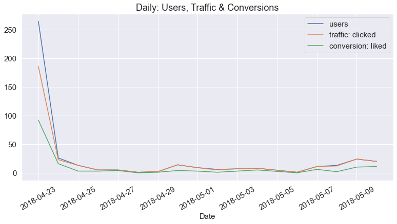


```python
# Conversion Rate
round((daily_conversions[conversion_label]/daily_traffic[traffic_label]).mean()*100,2)
```

    40.43

```python
# Average Traffic / User
round((daily_traffic[traffic_label]/daily_users[user_label]).mean(),2)
```

    0.96

```python
# Average Conversions / User
round((daily_conversions[conversion_label]/daily_users[user_label]).mean(),2)
```

    0.39

##### Таблица сегментов


```python
# выделение колонок для агрегата'traffic' / 'conversion'
aggregation_column = [traffic_label, conversion_label]
traffic = []
conversions = [] 

# расчет агрегатов
for i in range(variations):
    v, c = df[df[segment_label] == segment_list[i] ][aggregation_column[:2]].sum()

    traffic.append(v)
    conversions.append(c)
    
    
# новый DF   
dfp_simple = pd.DataFrame({
    "converted": conversions,
    "traffic": traffic
}, index = segment_list)

dfp_simple

#dfp = dfp_simple.copy().sort_index()
```

<div>
<style scoped>
    .dataframe tbody tr th:only-of-type {
        vertical-align: middle;
    }

    .dataframe tbody tr th {
        vertical-align: top;
    }

    .dataframe thead th {
        text-align: right;
    }
</style>
<table border="1" class="dataframe">
  <thead>
    <tr style="text-align: right;">
      <th></th>
      <th>converted</th>
      <th>traffic</th>
    </tr>
  </thead>
  <tbody>
    <tr>
      <th>A1</th>
      <td>42</td>
      <td>86</td>
    </tr>
    <tr>
      <th>A2</th>
      <td>37</td>
      <td>88</td>
    </tr>
  </tbody>
</table>
</div>


```python
dfp = dfp_simple.copy().sort_index()

# Сумма по всем колонкам
dfp.loc['Total'] = dfp.sum()

# определение не сконвертируемых
dfp['not_converted'] = dfp['traffic'] - dfp['converted']

# отношение конвертируемых к траффику
proportion = dfp.converted/dfp.traffic
dfp['converted_proportion'] = proportion

# STD
dfp['standard_error'] = ((proportion * (1-proportion))/dfp.traffic)**(.5)

# % траффика
n = dfp.loc['Total']['traffic']
dfp['population_percentage'] = dfp['traffic']/n

dfp
```


<div>
<style scoped>
    .dataframe tbody tr th:only-of-type {
        vertical-align: middle;
    }

    .dataframe tbody tr th {
        vertical-align: top;
    }

    .dataframe thead th {
        text-align: right;
    }
</style>
<table border="1" class="dataframe">
  <thead>
    <tr style="text-align: right;">
      <th></th>
      <th>converted</th>
      <th>traffic</th>
      <th>not_converted</th>
      <th>converted_proportion</th>
      <th>standard_error</th>
      <th>population_percentage</th>
    </tr>
  </thead>
  <tbody>
    <tr>
      <th>A1</th>
      <td>42</td>
      <td>86</td>
      <td>44</td>
      <td>0.488372</td>
      <td>0.053902</td>
      <td>0.494253</td>
    </tr>
    <tr>
      <th>A2</th>
      <td>37</td>
      <td>88</td>
      <td>51</td>
      <td>0.420455</td>
      <td>0.052621</td>
      <td>0.505747</td>
    </tr>
    <tr>
      <th>Total</th>
      <td>79</td>
      <td>174</td>
      <td>95</td>
      <td>0.454023</td>
      <td>0.037744</td>
      <td>1.000000</td>
    </tr>
  </tbody>
</table>
</div>


##### Plot


```python
# визуализируем BarPlot
labels = dfp.index[:-1].tolist()
label_index = np.arange(len(labels))
values = (round(dfp['converted_proportion'][:-1]*100,2)).tolist()
half_ci = (round(dfp['standard_error'][:-1]*1.96*100,2)).tolist()
plt.subplots(figsize=(13, 6))
plt.bar(label_index, values, yerr=half_ci, alpha=0.75,
       color= color_hex_list[0:len(labels)],
       error_kw=dict(ecolor='black', lw=2, capsize=5, capthick=2))
plt.xlabel('Segment', fontsize=15)
plt.ylabel('% Conversion', fontsize=15)
plt.xticks(label_index, labels, fontsize=13, rotation=30)
plt.yticks(fontsize=15)
plt.title('Conversion Rate / Segment', fontsize=18)
plt.show()
```


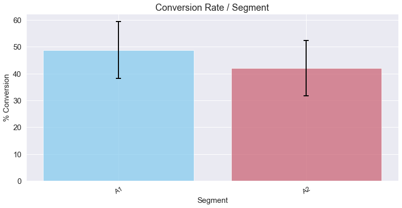


##### ТЕСТИРОВАНИЕ МОДЕЛИ ЛОКАЛЬНО

##### 2 Sample

*Тип теста: z-test*

- H0: Нет разницы между сегментами и уровнем конверсии
- H1: Есть разница между сегментами и уровнем конверсии

!-> A1 - основная, старая модель, все остальные это новые "челленджеры"

```python
variation1 = 'A1'
variation2 = 'A2'
```

##### Расчет параметров по каждому сегменту

```python
x1 = dfp.loc[variation1]['converted']
n1 = dfp.loc[variation1]['traffic']
x2 = dfp.loc[variation2]['converted']
n2 = dfp.loc[variation2]['traffic']

print(variation1, 'Converted:', x1)
print(variation1, 'Traffic:', n1)
print(variation2, 'Converted:', x2)
print(variation2, 'Traffic:', n2)
```

    A1 Converted: 42.0
    A1 Traffic: 86.0
    A2 Converted: 37.0
    A2 Traffic: 88.0
    
##### Сравнение результатов


```python
p1 = x1/n1
p2 = x2/n2
p = (x1+x2)/(n1+n2)
print('Кол-во (', variation1 ,'): {0:.2f}%'.format(100*p1))
print('Кол-во (', variation2 ,'): {0:.2f}%'.format(100*p2))
print('Среднее кол-во по всем группам: {0:.2f}%'.format(100*p))
print('% разница между группами: {0:.2f}%'.format(100*(p2-p1)))
print('% относительная разница между группами: {0:.2f}%'.format(100*(p2-p1)/p1))


var = p*(1-p)*(1/n1+1/n2)
se = math.sqrt(var)
print('\nVariance: {0:.4f}%'.format(100*var))
print('Standard Error: {0:.2f}%'.format(100*se))

z = (p1-p2)/se
pvalue = 1-stats.norm.cdf(abs(z))
pvalue *= 2-one_sided
print('\nz-stat: {z}'.format(z=z))
print('p-value: {p}'.format(p=pvalue))
```

    Кол-во ( A1 ): 48.84%
    Кол-во ( A2 ): 42.05%
    Среднее кол-во по всем группам: 45.40%
    % разница между группами: -6.79%
    % относительная разница между группами: -13.91%
    
    Variance: 0.5699%
    Standard Error: 7.55%
    
    z-stat: 0.8996463724803273
    p-value: 0.184154235386902
    

##### Фиксирование разниц


```python
m_proportion = abs(min((1-p1),(1-p1))-1)
min_detectable_effect_size = measurable_effect_size(min([n1, n2]), alpha_Zscore, beta_Zscore, m_proportion)
print("Для текущего размера группы {n} и с baseline {m:.2f},\nмы можем получить разницу в {e:.2f}%."
      .format(n = min([n1, n2]), m = m_proportion, e=min_detectable_effect_size*100))
print('\n')


n1 = sample_size(p2-p1, alpha_Zscore, beta_Zscore, baseline_probability)
print("Разница {d:.2f}%, которая требуется для минимальной группы {n_needed}"
      .format(d=abs(100*(p2-p1)), n_needed = round(n1,0)))
print('\n')

print("Alpha - {a:.2f}\nBeta - {b:.2f}".format(a = alpha_Zscore, b = beta_Zscore))
```

    Для текущего размера группы 86.0 и с baseline 0.49,
    мы можем получить разницу в 18.95%.
    
    
    Разница 6.79%, которая требуется для минимальной группы 241.0
    
    
    Alpha - 1.64
    Beta - 0.84
    

**Нужно ли больше данных?**


```python
abs(p2-p1) >= min_detectable_effect_size

if abs(p2-p1) >= min_detectable_effect_size:
    print("Нет, данных достаточно для определения значимости")
else:
    print("Да, мы должны получить больше данных для определения значимости изменений")
```

    Да, мы должны получить больше данных для определения значимости изменений
    

#####  Интерпритация результатов

! -> Только, если больше не нужно больше данных


```python
print('p-value {p} меньше, чем alpha, {alpha}?\n'.format(p=round(pvalue,5), alpha=alpha))
if (pvalue < alpha):
    print('p-value меньше, чем alpha, 0-гипотеза отвергается (null-hypothesis = no difference)')
else: 
    print('Нет, 0-гипотеза не может быть отвергнута')
```

    p-value 0.18415 меньше, чем alpha, 0.05?
    
    Нет, 0-гипотеза не может быть отвергнута
    

##### Доверительный интервал - для эффективного размера группы


```python
# z-statistics
z_critical = stats.norm.ppf(1-alpha*(1-0.5*(1-one_sided)))

# верхний и нижний уровень значимости
ci_low = (p2-p1) - z_critical*se
ci_upp = (p2-p1) + z_critical*se

print(' 95% Confidence Interval = ( {0:.2f}% , {1:.2f}% )'
      .format(100*ci_low, 100*ci_upp))
```

     95% Confidence Interval = ( -19.21% , 5.63% )
    

##### Stats Model Formula

2х хвостовой тест


```python
counts = np.array([x1, x2])
nobs = np.array([n1, n2])

stat, pval = proportions_ztest(counts, nobs, alternative = 'smaller')
print('z-stat: {0:.4f}'.format(stat))
print('p-value: {0:.8f}'.format(pval))
```

    z-stat: -4.6325
    p-value: 0.00000181
    

##### Extra


```python
# 2х хвостовой тест результат
pvalue = 1-stats.norm.cdf(abs(z))
pvalue *= 2-False
print('p-value: {p}'.format(p=pvalue))
```

    p-value: 0.368308470773804
    


```python
# 1 хвостовой тест
pvalue = 1-stats.norm.cdf(abs(z))
pvalue *= 2-True
print('p-value: {p}'.format(p=pvalue))
```

    p-value: 0.184154235386902
    

##### 2+ Sample Proportion

*Тип теста: Chi Square*

**Гипотезы**

- H0: Нет разницы между сегментами и уровнем конверсии
- H1: Есть разница между сегментами и уровнем конверсии 

##### Main Question: 

Есть разница между моделями (сегментами)? 


```python
# Повторю загрузку для добавления сегментов
file_name = 'Data/sd.csv'
date_sort = 'date_visit'
data = pd.read_csv(file_name,
                  converters= {date_sort: pd.to_datetime} )

df = data.copy()
df = df.sort_values(date_sort, ascending = True)
df = df[df['version'].isin(['A1', 'A2','B', 'C'])]

traffic_label = 'clicked'
conversion_label = 'liked'
user_label = 'user_id'
date_label = 'date_visit'
segment_label = 'version'
segment_list = list(df[segment_label].unique())
variations = len(segment_list)

aggregation_column = [traffic_label, conversion_label]
traffic = []
conversions = [] 

for i in range(variations):
    v, c = df[df[segment_label] == segment_list[i] ][aggregation_column[:2]].sum()
    
    traffic.append(v)
    conversions.append(c)
    
dfp_simple = pd.DataFrame({
    "converted": conversions,
    "traffic": traffic}, 
    index = segment_list)


dfp = dfp_simple.copy().sort_index()
dfp.loc['Total'] = dfp.sum()
dfp['not_converted'] = dfp['traffic'] - dfp['converted']
proportion = dfp.converted/dfp.traffic
dfp['converted_proportion'] = proportion
dfp['standard_error'] = ((proportion * (1-proportion))/dfp.traffic)**(.5)
n = dfp.loc['Total']['traffic']
dfp['population_percentage'] = dfp['traffic']/n
dfp
```

<div>
<style scoped>
    .dataframe tbody tr th:only-of-type {
        vertical-align: middle;
    }

    .dataframe tbody tr th {
        vertical-align: top;
    }

    .dataframe thead th {
        text-align: right;
    }
</style>
<table border="1" class="dataframe">
  <thead>
    <tr style="text-align: right;">
      <th></th>
      <th>converted</th>
      <th>traffic</th>
      <th>not_converted</th>
      <th>converted_proportion</th>
      <th>standard_error</th>
      <th>population_percentage</th>
    </tr>
  </thead>
  <tbody>
    <tr>
      <th>A1</th>
      <td>42</td>
      <td>86</td>
      <td>44</td>
      <td>0.488372</td>
      <td>0.053902</td>
      <td>0.248555</td>
    </tr>
    <tr>
      <th>A2</th>
      <td>37</td>
      <td>88</td>
      <td>51</td>
      <td>0.420455</td>
      <td>0.052621</td>
      <td>0.254335</td>
    </tr>
    <tr>
      <th>B</th>
      <td>48</td>
      <td>92</td>
      <td>44</td>
      <td>0.521739</td>
      <td>0.052079</td>
      <td>0.265896</td>
    </tr>
    <tr>
      <th>C</th>
      <td>37</td>
      <td>80</td>
      <td>43</td>
      <td>0.462500</td>
      <td>0.055744</td>
      <td>0.231214</td>
    </tr>
    <tr>
      <th>Total</th>
      <td>164</td>
      <td>346</td>
      <td>182</td>
      <td>0.473988</td>
      <td>0.026844</td>
      <td>1.000000</td>
    </tr>
  </tbody>
</table>
</div>


```python
dfpTo = dfp[['converted', 'not_converted', 'traffic']].T
dfpTo
```


<div>
<style scoped>
    .dataframe tbody tr th:only-of-type {
        vertical-align: middle;
    }

    .dataframe tbody tr th {
        vertical-align: top;
    }

    .dataframe thead th {
        text-align: right;
    }
</style>
<table border="1" class="dataframe">
  <thead>
    <tr style="text-align: right;">
      <th></th>
      <th>A1</th>
      <th>A2</th>
      <th>B</th>
      <th>C</th>
      <th>Total</th>
    </tr>
  </thead>
  <tbody>
    <tr>
      <th>converted</th>
      <td>42</td>
      <td>37</td>
      <td>48</td>
      <td>37</td>
      <td>164</td>
    </tr>
    <tr>
      <th>not_converted</th>
      <td>44</td>
      <td>51</td>
      <td>44</td>
      <td>43</td>
      <td>182</td>
    </tr>
    <tr>
      <th>traffic</th>
      <td>86</td>
      <td>88</td>
      <td>92</td>
      <td>80</td>
      <td>346</td>
    </tr>
  </tbody>
</table>
</div>


##### % пропорций (вероятности)


```python
dfpTe = dfpTo.copy()

# заменим вероятностями
for i in range(variations):
    for j in range(0, 2):
        dfpTe.iloc[j,i] = (dfpTo.loc['traffic'][i]*dfpTo['Total'][j])/n
```

##### Chi Square / p-value


```python
o = dfpTo.drop(dfpTo.columns[-1], axis = 1)[:-1]
e = dfpTe.drop(dfpTe.columns[-1], axis = 1)[:-1]

ss = (o-e)**2/e
ch2 = ss.values.sum()
ch2
```

    1.9666036399234188

```python
# P-value (степень свободы - 1)
pvalue_chi = 1 - stats.chi2.cdf(ch2, variations-1)
pvalue_chi
```

    0.5793670974852936

##### Интерпретация результатов


```python
print('p-value {p} меньше, чем alpha, {alpha}?\n'.format(p=round(pvalue_chi,5), alpha=alpha))
if (pvalue < alpha):
    print('p-value меньше, чем alpha, 0-гипотеза отвергается (null-hypothesis = no difference)')
else: 
    print('Нет, 0-гипотеза не может быть отвергнута')
```

    p-value 0.57937 меньше, чем alpha, 0.05?
    
    Нет, 0-гипотеза не может быть отвергнута
    

---

##### Main Question: 

Какая модель (сегмент) лучше?

##### Marascuilo Procedure (аналог Tukey-Kramer Test)

О тесте: [ссылка](https://www.itl.nist.gov/div898/handbook/prc/section4/prc474.htm)


```python
# списки итерации
prp = list(dfp_simple['converted']/dfp_simple['traffic'])
vis = list(dfp_simple['traffic'])
seg = list(dfp_simple.index.values)

# Хи2
c2 = stats.chi2.cdf(ch2, variations-1)

# списки для заполнения в цикле
diff = []
critical_value = []
segment1 = []
segment2 = []
proportion1 = []
proportion2 = []
segment1_size = []
segment2_size = []
smallest_measurable_effect_size = []
```


```python
# Парное сравнение сегментов (моделей)
# Перебор всех со всеми
for i in range(0,(variations)):
    for j in range((i+1),variations):
        segment1.append(seg[i])
        segment2.append(seg[j])
        
        proportion1.append(prp[i])
        proportion2.append(prp[j])
        
        segment1_size.append(vis[i])
        segment2_size.append(vis[j])
        smaller_sample_size = min(vis[i], vis[j])
        max_proportion = abs(min((1-prp[i]),(1-prp[j]))-1)
        es = measurable_effect_size(smaller_sample_size, alpha_Zscore, beta_Zscore, max_proportion)
        smallest_measurable_effect_size.append(es)

        d = prp[i]-prp[j]
        diff.append(d)
    
        cr = math.sqrt(c2)*math.sqrt(prp[i]*(1-prp[i])/vis[i] + prp[j]*(1-prp[j])/vis[j])
        critical_value.append(cr)

```


```python
# Создаем DataFrame на основе вычислений
dfm = []
dfm = pd.DataFrame({
    "segment1" : segment1,
    "segment2" : segment2,
    "segment1_size": segment1_size,
    "segment2_size": segment2_size,
    "proportion1": proportion1,
    "proportion2": proportion2,
    "smallest_measurable_effect_size": smallest_measurable_effect_size,
    "diff": diff,
    "critical_value": critical_value
})
```

##### Определим значимость

Необходимые переменные:
- alpha 
- beta 
- размер теста
- эффективный размер сегмента для теста


```python
# сделаем фильтр всех результатов
dfm['significant'] = (abs(dfm['diff']) > dfm['critical_value'])
# определим финальный фильтр для таблицы
dfm['signficant_effect_size'] = ( (abs(dfm['diff']) > dfm['critical_value']) & ( dfm['diff'] >= 
                                 dfm['smallest_measurable_effect_size']) )
    
# обозначим наименование колонок
column_order = ['segment1', 'proportion1', 'segment2', 'proportion2', 'diff', 'smallest_measurable_effect_size',
                'critical_value', 'significant', 'signficant_effect_size']

# сортировка по наибольшему стат.эффекту
dfm[column_order].sort_values(['diff', 'signficant_effect_size'], ascending = [False, True])
```

<div>
<style scoped>
    .dataframe tbody tr th:only-of-type {
        vertical-align: middle;
    }

    .dataframe tbody tr th {
        vertical-align: top;
    }

    .dataframe thead th {
        text-align: right;
    }
</style>
<table border="1" class="dataframe">
  <thead>
    <tr style="text-align: right;">
      <th></th>
      <th>segment1</th>
      <th>proportion1</th>
      <th>segment2</th>
      <th>proportion2</th>
      <th>diff</th>
      <th>smallest_measurable_effect_size</th>
      <th>critical_value</th>
      <th>significant</th>
      <th>signficant_effect_size</th>
    </tr>
  </thead>
  <tbody>
    <tr>
      <th>2</th>
      <td>B</td>
      <td>0.521739</td>
      <td>A2</td>
      <td>0.420455</td>
      <td>0.101285</td>
      <td>0.187248</td>
      <td>0.048017</td>
      <td>True</td>
      <td>False</td>
    </tr>
    <tr>
      <th>5</th>
      <td>A1</td>
      <td>0.488372</td>
      <td>A2</td>
      <td>0.420455</td>
      <td>0.067918</td>
      <td>0.189541</td>
      <td>0.048855</td>
      <td>True</td>
      <td>False</td>
    </tr>
    <tr>
      <th>0</th>
      <td>B</td>
      <td>0.521739</td>
      <td>C</td>
      <td>0.462500</td>
      <td>0.059239</td>
      <td>0.196387</td>
      <td>0.049477</td>
      <td>True</td>
      <td>False</td>
    </tr>
    <tr>
      <th>4</th>
      <td>C</td>
      <td>0.462500</td>
      <td>A2</td>
      <td>0.420455</td>
      <td>0.042045</td>
      <td>0.196019</td>
      <td>0.049717</td>
      <td>False</td>
      <td>False</td>
    </tr>
    <tr>
      <th>1</th>
      <td>B</td>
      <td>0.521739</td>
      <td>A1</td>
      <td>0.488372</td>
      <td>0.033367</td>
      <td>0.189413</td>
      <td>0.048610</td>
      <td>False</td>
      <td>False</td>
    </tr>
    <tr>
      <th>3</th>
      <td>C</td>
      <td>0.462500</td>
      <td>A1</td>
      <td>0.488372</td>
      <td>-0.025872</td>
      <td>0.196520</td>
      <td>0.050291</td>
      <td>False</td>
      <td>False</td>
    </tr>
  </tbody>
</table>
</div>


##### Какая модель имеет статистическую значимость?


```python
dfm[dfm['signficant_effect_size'] == True][['segment1', 'segment2']]
```


<div>
<style scoped>
    .dataframe tbody tr th:only-of-type {
        vertical-align: middle;
    }

    .dataframe tbody tr th {
        vertical-align: top;
    }

    .dataframe thead th {
        text-align: right;
    }
</style>
<table border="1" class="dataframe">
  <thead>
    <tr style="text-align: right;">
      <th></th>
      <th>segment1</th>
      <th>segment2</th>
    </tr>
  </thead>
  <tbody>
  </tbody>
</table>
</div>


---

##### Вывод: 

Все новые модели не имееют значительного улучшения и не могут быть приняты. 

Модель A2 имеет потенциал. 


-----------

#### Спасибо!


#### Оставьте обратную связь

[Ссылка](https://forms.gle/tjVHYVzB258bAj9n6) на форму обратной связи
